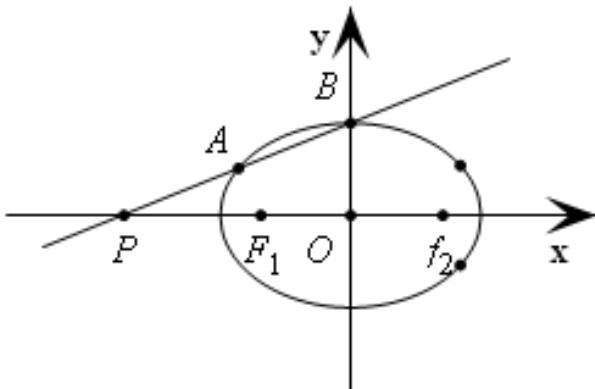

<!-- question-source:start -->
20、已知 $\Gamma:\frac{x^{2}}{2}+y^{2}=1,F_{1}\setminus F_{2}$ 是其左右焦点， $P(m,0)(m<-\sqrt{2})$ ，直线 l 过点 P 交 $\Gamma$ 于 A、B 两点，且 A 在线段 BP 上.

(1)若 $B$ 是上顶点， $\left|BF_1\right| = \left|PF_1\right|$ ，求 $m$ 的值；

(2)若 $F_{1}A \cdot F_{2}A = \frac{1}{3}$ ，且原点 $O$ 到直线 $l$ 的距离为 $\frac{4\sqrt{15}}{15}$ ，求直线 $l$ 的方程；

(3)证明：证明：对于任意 $m < -\sqrt{2}$ ，总存在唯一一条直线使得 $F_{1}A // F_{2}B$ 。

$$
\begin{array}{c c} \text {uu} & \text {uu} \\ \hline \end{array}
$$

<!-- question-source:end -->

![[高中/真题/按年份分类/2021/2021年上海市夏季高考数学试卷/解答题/题目/answers/Q00025616A1.md]]
