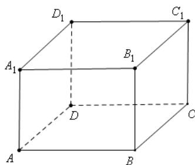

<!-- question-source:start -->
18、在 $\Delta ABC$ 中，已知 $a = 3, b = 2c$

(1)若 $\angle A = \frac{2\pi}{3}$ , 求 $\Delta ABC$ 的面积;
(2)若 $2\sin B - \sin C = 1$ , 求 $\Delta ABC$ 的周长.

<!-- question-source:end -->

![[高中/真题/按年份分类/2021/2021年上海市夏季高考数学试卷/解答题/题目/answers/Q00029620A1.md]]
