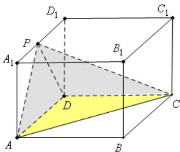
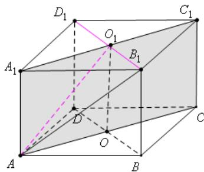

> [!faq]- 2021年上海市夏季高考数学试卷解析
>
> > [!success]- **【答案】** 详见解析
>
> > [!note]- **【分析】**
> > （1)利用体积计算公式计算；
> > （2）证明 $OB_{1} \perp$ 平面 $ACC_{1}A_{1}$ ，找到线面角度，再计算
> > 【
>
> > [!note]- **【解析】**
> > （1)如图1， $V_{P-ADC} = \frac{1}{3} S_{\triangle ADC} \times h = \frac{1}{3} \times \frac{1}{2} \times 2 \times 2 \times 3 = 2$ ；
> > (2) 如图 2, $QOB_{1} \perp A_{1}C_{1}, OB_{1} \perp OO_{1} \therefore OB_{1} \perp$ 平面 $ACC_{1}A_{1} \therefore \theta = \angle B_{1}AO_{1}$ 为 $AB_{1}$ 与平面 $ACC_{1}A_{1}$ 所成的角；在 $Rt\Delta B_{1}AO_{1}$ 中 $B_{1}O_{1} = \sqrt{2}, AB_{1} = \sqrt{13}, \sin \theta = \frac{B_{1}O_{1}}{AB_{1}} = \frac{\sqrt{2}}{\sqrt{13}} = \frac{\sqrt{26}}{13}, \theta = arc\sin \frac{\sqrt{26}}{13}$
> >
> > 
> >
> >   
> > 图1  
> > 图2
> >
> > 【归纳总结】本题考查棱锥的体积、线面角的求法，理解线面角的定义，考查学生的空间立体感、逻辑推理能力和运算能力，属于基础题.
