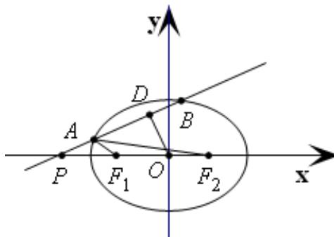
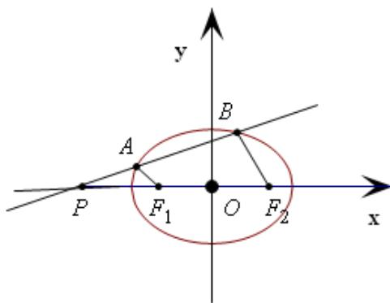

> [!faq]- 2021年上海市夏季高考数学试卷解析
>
> > [!success]- **【答案】** 详见解析
>
> > [!note]- **【分析】**
> > （1）根据椭圆的定义以及 $\left|BF_{1}\right|=\left|PF_{1}\right|$ 建立关于m的方程；
> > (2)
>
> > [!note]- **【解析】**
> > (1) $\Gamma : \frac{x^2}{2} + y^2 = 1, F_1(-1,0) \setminus F_2(1,0) \quad |BF_1| = \sqrt{2}, |PF_1| = -1 - m$ ;
> >
> > $$
> > \left| \begin{array}{l} \mathbf {u u u} \\ B F _ {1} \end{array} \right| = \left| \begin{array}{l} \mathbf {u u u} \\ P F _ {1} \end{array} \right|, - 1 - m = \sqrt {2}, m = - 1 - \sqrt {2}
> > $$
> > (2) 设 $A(x_{1},y_{1}), F_{1}A = (x_{1} + 1,y_{1}), F_{2}A = (x_{1} - 1,y_{1})$ ;
> >
> > $$
> > F _ {1} A \cdot F _ {2} A = \frac {1}{3} = x _ {1} ^ {2} + y _ {1} ^ {2} - 1, x _ {1} ^ {2} + y _ {1} ^ {2} = \frac {4}{3},
> > $$
> >
> > $$
> > \left\{ \begin{array}{l} x _ {1} ^ {2} + y _ {1} ^ {2} = \frac {4}{3}, \\ \frac {x _ {1} ^ {2}}{2} + y _ {1} ^ {2} = 1 \end{array} \therefore A \left(- \frac {\sqrt {6}}{3}, \frac {\sqrt {6}}{3}\right) \right.
> > $$
> >
> > 
> >
> > 设 $l:y = k(x + \frac{\sqrt{6}}{3}) + \frac{\sqrt{6}}{3} = kx + \frac{\sqrt{6}}{3} (k + 1)$ ，原点 $O$ 到直线 $l$ 的距离为
> >
> > $$
> > \frac {4 \sqrt {1 5}}{1 5}
> > $$
> >
> > $d = \frac{\left|\frac{\sqrt{6}}{3}k + \frac{\sqrt{6}}{3}\right|}{\sqrt{1 + k^2}} = \frac{4\sqrt{15}}{15} \Rightarrow 3k^2 - 10k + 3 = 0 = 3 \Rightarrow k = 3$ 或 $k = \frac{1}{3}$ （ $A$ 在线段 $BP$ 上， $k = 3$ ，舍去）
> >
> > $$
> > l: 3 x - 9 y + 4 \sqrt {6} = 0
> > $$
> > (3) 设 $A(x_{1},y_{1}),B(x_{2},y_{2})$ ，直线 $l:x = hy + m$
> >
> > $F_{1}A / / F_{2}B$ ，则 $\frac{y_2}{y_1} = \frac{1 - m}{-1 - m} = \frac{m - 1}{m + 1}$ ， $\therefore y_{2} = \frac{m - 1}{m + 1} y_{1}$
> >
> > 联立直线与椭圆得
> >
> > $$
> > \left\{ \begin{array}{l} x = h y + m \\ \frac {x ^ {2}}{2} + y ^ {2} = 1 \end{array} \Rightarrow (h ^ {2} + 2) y ^ {2} + 2 m h y + m ^ {2} - 2 = 0. \right.
> > $$
> >
> > 
> >
> > 即 $y_{1} + y_{2} = -\frac{2mh}{h^{2} + 2},\quad y_{1}y_{2} = \frac{m^{2} - 2}{h^{2} + 2}$ 所以 $\left(1 + \frac{m - 1}{m + 1}\right)y_1 = -\frac{2mh}{h^2 + 2},\frac{m - 1}{m + 1} y_1^2 = \frac{m^2 - 2}{h^2 + 2}$
> >
> > 代入 $y_{1} = \frac{-h(2n + 1)}{h^{2} + 2}$ ， $\frac{m - 1}{m + 1} \times \frac{h^{2}(m + 1)^{2}}{(h^{2} + 2)^{2}} = \frac{m^{2} - 2}{h^{2} + 2}$
> >
> > 所以 $(m^2 - 1)h^2 = (m^2 - 2)(h^2 + 2)$ ， $m^2h^2 - h^2 = m^2h^2 - 2h^2 + 2m^2 - 4$
> >
> > $\therefore h^{2}=2m^{2}-4 \Rightarrow h=\sqrt{2m^{2}-4} \Rightarrow k=\frac{1}{\sqrt{2m^{2}-4}},$
> >
> > 即对于任意 $m < -\sqrt{2}$ ，使得 $F_{1}A // F_{2}B$ 的直线有且仅有一条；
> >
> > 【归纳总结】本题主要考查直线与椭圆的位置关系以及根与系数的关系的应用，属于难题.
