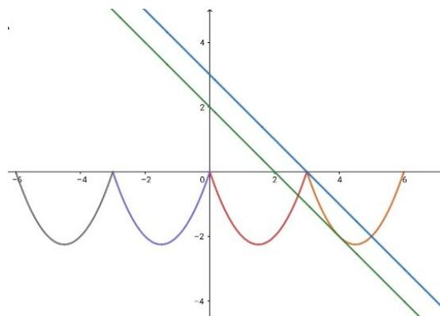
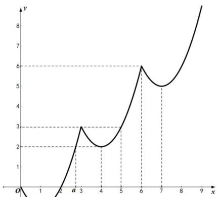

> [!faq]- 2021年上海市夏季高考数学试卷解析
>
> > [!success]- **【答案】** 详见解析
>
> > [!note]- **【分析】**
> > （1）根据“关联”定义进行判断；
>
> > [!note]- **【解析】**
> > 是 $[1 + \sqrt{3},5]$
> >
> > 
> >
> > (3) 充分性: $\because f(x+1)=f(x)+1$ , 且 $f(x)$ 递增, 所
> >
> > 以对于 $x + 1\leq y\leq x + 2$
> >
> > $f(x) + 1 = f(x + 1)\leq f(y)\leq f(x + 2) = f(x) + 2$ 成立。
> >
> > 必要性：∵ $f(x+1)-f(x)\geq1$ ， $f(x+2)-f(x+1)\geq1$ ， $f(x+2)-f(x)\leq2$
> >
> > 可以得到 $f(x + 1) = f(x) + 1$
> >
> > 故对 $x < y \leq x + 1$ ，我们对 $x, y + 1$ 用[1,2]关联的条件得到 $f(x) + 1 \leq f(y + 1) = f(y) + 1$
> >
> > 于是 $f(x)\leq f(y)$ .对于正整数 $n$ ， $x + n <   y\leq x + n + 1$
> >
> > 则有 $f(y)=f(y-n)+n\geq f(x)+n>f(x)$ .也成立.
> >
> > 方法二：（1）①设 $x_{1} - x_{2}\in [0, + \infty)$ ， $x_{1} - x_{2}\geq 1$ 且为 $[0, + \infty)$
> >
> > $f(x_{1}) - f(x_{2}) = 2x_{1} - 1 - 2x_{2} + 1 = 2(x_{1} - x_{2})\geq 2$ 且满足 $\left[0, + \infty\right)$ ， $f(x) = 2x - 1$ 是 $\left[0, + \infty\right)$ 关联的.
> >
> > ② 设 $x_{1}-x_{2}\in\left[0,1\right]$ ， $f(x_{1})-f(x_{2})=2x_{1}-1-2x_{2}+1=2(x_{1}-x_{2})\in\left[0,2\right]$
> >
> > 故 $f(x) = 2x - 1$ 不是 $[0,1]$ 关联的.
> >
> > (2) 因为 $f(x)$ 是 $\left\{3\right\}$ 关联的，所以当任意的 $x \in R$ 时， $f(x + 3) - f(x) = 3$ ，
> >
> > 又∵ $x\in [0,3)$ 时， $f(x) = x^2 - 2x$ ，函数图像如下图：
> >
> > 易知， $a = 1 + \sqrt{3}$ ，∴原不等式的解为 $[a,5]$ 即为 $\left[1 + \sqrt{3},5\right]$
> >
> > 
> >
> > (3) 证明：∵ $f(x)$ 是 $\{1\}$ 关联，可知对任意的 $x \in R$ 有 $f(x+1) - f(x) = 1$ ，
> >
> > $\because f(x)$ 是 $[0, +\infty)$ 关联，可知对任意的 $x_{1}, x_{2} \in [0, +\infty)$ 有 $\left\{ \begin{array}{l} x_{1} - x_{2} \geq 0 \\ f(x_{1}) - f(x_{2}) \geq 0 \end{array} \right.$ ，为不减函数；
> >
> > 可以设 $g(\Delta x) = f(x + \Delta x) - f(x)$ .
> >
> > 当 $\Delta x = 1$ 时， $g(1) = f(x + 1) - f(x) = 1$ ，
> >
> > 当 $\Delta x = 2$ 时， $g(2) = f(x + 2) - f(x) = f(x + 1) + 1 - f(x) = 2$
> >
> > 因为当 $x$ 确定时， $g(\Delta x)$ 是关于 $\Delta x$ 的不减函数，所以 $\Delta x \in [12]$ ， $g(\Delta x) \in [12]$
> >
> > ∴有 $f(x)$ 是 $[1,2]$ 关联.
> >
> > ② 当 $f(x)$ 是 $[1,2]$ 关联，有 $\Delta x\in [1,2]$ ， $\therefore g(\Delta x) = f(x + \Delta x) - f(x)\in [1,2]$ ，
> >
> > $$
> > g (1) = f (x + 1) - f (x) \in [ 1, 2 ], g (2) = f (x + 2) - f (x) \in [ 1, 2 ]
> > $$
> >
> > 假设 $g(1)>1$ ，有 $f(x+1)-f(x)>1$ . ∴ $f(x+2)-f(x)>f(x+1)+1-f(x)>2$ ，
> >
> > 又∵ $g(2)=f(x+2)-f(x)\in\left[1,2\right]$ ，矛盾.
> >
> > 故只有 $g(1)=1$ ，易得 $g(2)=2$ 。
> >
> > 利用 $f(x + 1) - f(x) = 1$ ，得 $f(x)$ 是 $\{1\}$ 关联，
> >
> > 依次可得 $g(n) = n$ ， $n\in \mathbf{Z}^{+}$
> >
> > 即当 $\Delta x \in [n, n + 1]$ ，有 $g(\Delta x) \in [n, n + 1]$ ，
> >
> > 当在 $n \to +\infty$ 时， $\Delta x \in [0, +\infty)$ ， $g(\Delta x) \in [0, +\infty)$ .
> >
> > 【归纳总结】本题主要考查了新定义以及函数性质的综合应用，体现了数形结合思想的应用，同时考查了学生
> >
> > 式作出函数图像，利用图像解不等式；
> >
> > (3) 分为充分性、必要性两个方面证明;
> >
> > 【
