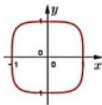
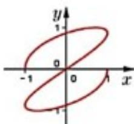
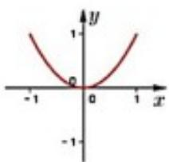
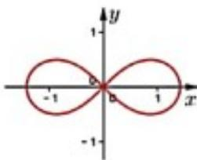

<!-- question-source:start -->
14、已知参数方程 $\left\{ \begin{array}{l} x = 3t - 4t^3 \\ y = 2t + \sqrt{1 - t^2} (t \in [-1,1]) \end{array} \right.$ ，以下哪个图像是该方程的图像（）

  
A.

B.

  
C.

D.
<!-- question-source:end -->

![[高中/真题/按年份分类/2021/2021年上海市夏季高考数学试卷/选择题/题目/answers/Q00025610A1.md]]
