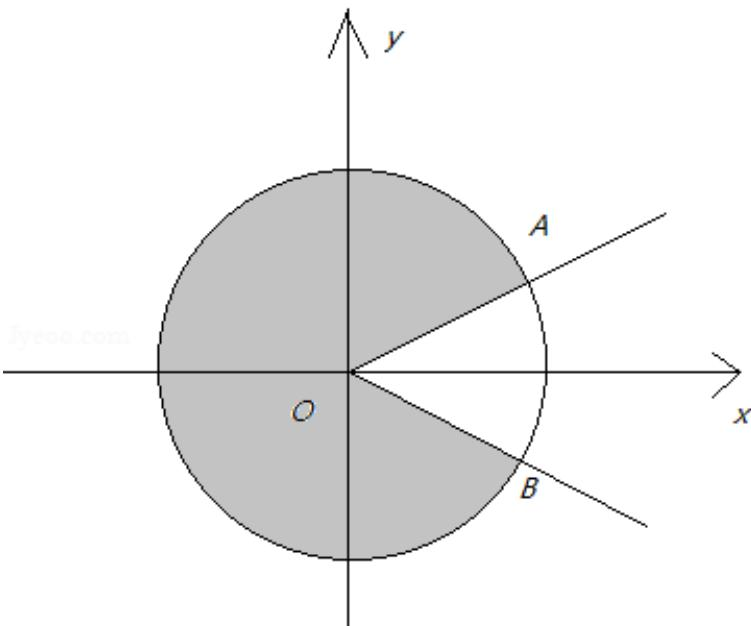

> [!faq]- 2021年上海市春季高考数学试卷解析
>
> > [!success]- **【答案】** $\frac{2\pi}{5}$
>
> > [!note]- **【分析】**
> > 本题未单列分析。
>
> > [!note]- **【解析】**
> > 在单位圆中分析，由题意可得 $n\theta + \varphi$ 的终边要落在图中阴影部分区域（其中 $\angle AOX = \angle BOx = \frac{\pi}{6}$ ），
> >
> > 所以 $\theta >\angle AOB = \frac{\pi}{3}$
> >
> > 因为对任意 $n \in N^{*}$ 都成立，
> >
> > 所以 $\frac{2\pi}{\theta}\in N^*$ ，即 $\theta = \frac{2\pi}{k}$ ， $k\in N^{*}$
> >
> > 同时 $\theta > \frac{\pi}{3}$ ，所以 $\theta$ 的最小值为 $\frac{2\pi}{5}$ .
> >
> > 故答案为： $\frac{2\pi}{5}$ .
> >
> > 
> >
> > 【归纳总结】本题主要考查三角函数的最值，考查数形结合思想，属于中档题.
> >
> > ##
> > 二、选择题（本大题共4题，每题5分，共20分）
