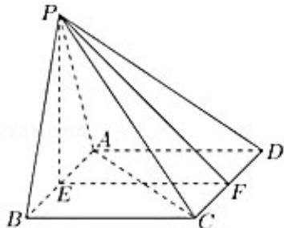

<!-- question-source:start -->
17.（14分）四棱锥 $P - ABCD$ ，底面为正方形ABCD，边长为4， $E$ 为 $AB$ 中点， $PE \perp$ 平面ABCD.

(1) 若 $\Delta PAB$ 为等边三角形, 求四棱锥 $P - ABCD$ 的体积;

(2) 若 $CD$ 的中点为 $F$ , $PF$ 与平面 $ABCD$ 所成角为 $45^{\circ}$ , 求 $PC$ 与 $AD$ 所成角的大小.
<!-- question-source:end -->

![[高中/真题/按年份分类/2021/2021年上海市春季高考数学试卷/解答题/题目/answers/Q00025592A1.md]]
