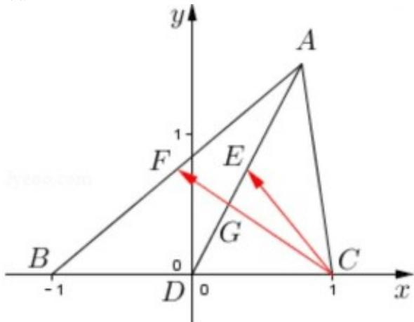

> [!faq]- 2021年上海市春季高考数学试卷解析
>
> > [!success]- **【答案】** B
>
> > [!note]- **【分析】**
> > 设 $A(2x,2y)$ ， $B(-1,0)$ ， $C(1,0)$ ， $D(0,0)$ ， $E(x,y)$ ，由向量数量的坐标运算即可判断①；F 为 AB 中点，可得 $(CB+CA)=2CF$ ，由 D 为 BC 中点，可得 CF 与 AD 的交点即为重心 G，从而可判断②
>
> > [!note]- **【解析】**
> > 不妨设 $A(2x,2y)$ ， $B(-1,0)$ ， $C(1,0)$ ， $D(0,0)$ ， $E(x,y)$ ，
> > ① $AB=(-1-2x,-2y)$ ， $CE=(x-1,y)$ ，
> > 若 $AB \cdot CE = 0$ ，则 $-(1 + 2x)(x - 1) - 2y^{2} = 0$ ，即 $-(1 + 2x)(x - 1) = 2y^{2}$ ，满足条件的 $(x,y)$ 存在，例如 $(0,\frac{\sqrt{2}}{2})$ ，满足上式，所以①成立；
> > ② F 为 AB 中点， $(CB+CA)=2CF$ ，CF 与 AD 的交点即为重心 G，
> > 因为 G 为 AD 的三等分点，E 为 AD 中点，
> >
> > 所以 $CE$ 与 $CG$ 不共线，即②不成立.
> >
> > 故选：B.
> >
> > 
> >
> > 【归纳总结】本题主要考查平面向量数量积的运算，共线向量的判断，属于中档题.
> >
> > ##
