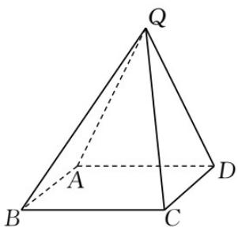

<!-- question-source:start -->
19. 在四棱锥 $Q - ABCD$ 中，底面 $ABCD$ 是正方形，若 $AD = 2, QD = QA = \sqrt{5}, QC = 3$ .

(1) 证明: 平面 $QAD \perp$ 平面 $ABCD$ ;

(2) 求二面角 $B - QD - A$ 的平面角的余弦值.
<!-- question-source:end -->

![[高中/真题/按年份分类/2021/2021年全国新高考II卷数学试题_解析版_/四_解答题/题目/answers/Q00020396A1.md]]
