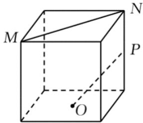
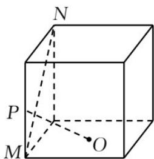
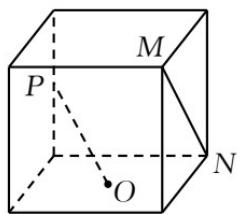
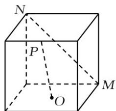

<!-- question-source:start -->
10. 如图，在正方体中，O 为底面的中心，P 为所在棱的中点，M，N 为正方体的顶点．则满足 $MN \perp OP$ 的是（）

A.

B.

C.

D.

【
<!-- question-source:end -->

![[高中/真题/按年份分类/2021/2021年全国新高考II卷数学试题_解析版_/选择题/题目/answers/Q00021860A1.md]]
