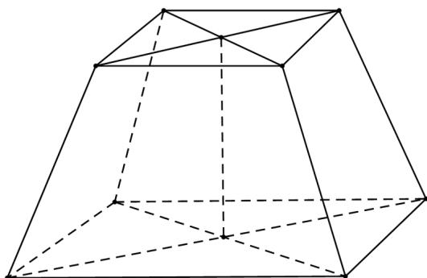

> [!faq]- 2021年全国新高考II卷数学试题（解析版）解析
>
> > [!success]- **【答案】** D
>
> > [!note]- **【分析】**
> > 由四棱台的几何特征算出该几何体的高及上下底面面积，再由棱台的体积公式即可得解.
> > 【
>
> > [!note]- **【解析】**
> > 作出图形，连接该正四棱台上下底面的中心，如图，
> >
> > 
> >
> > 因为该四棱台上下底面边长分别为2，4，侧棱长为2，
> > 所以该棱台的高 $h=\sqrt{2^{2}-\left(2\sqrt{2}-\sqrt{2}\right)^{2}}=\sqrt{2}$ 下底面面积 $S_{1}=16$ ，上底面面积 $S_{2}=4$ ，
> > 所以该棱台的体积 $V=\frac{1}{3}h\left(S_{1}+S_{2}+\sqrt{S_{1}S_{2}}\right)=\frac{1}{3}\times\sqrt{2}\times\left(16+4+\sqrt{64}\right)=\frac{28}{3}\sqrt{2}$
> >
> > 故选：D.
