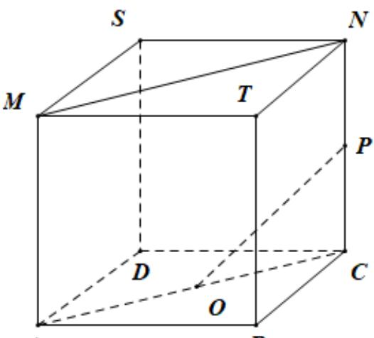
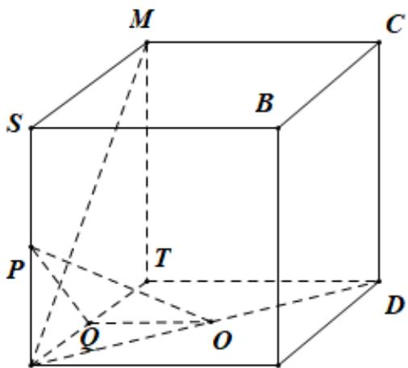
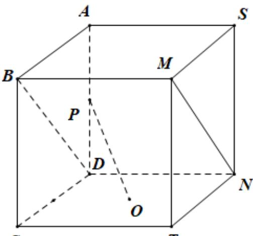
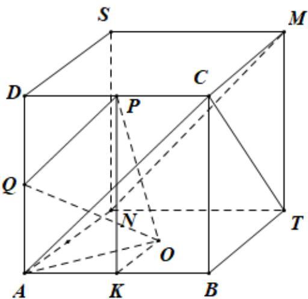

> [!faq]- 2021年全国新高考II卷数学试题（解析版）解析
>
> > [!success]- **【答案】** BC
>
> > [!note]- **【分析】**
> > 根据线面垂直的判定定理可得 BC 的正误，平移直线 MN 构造所考虑的线线角后可判断 AD 的正误.
>
> > [!note]- **【解析】**
> > 设正方体的棱长为2，
> >
> > 对于 A，如图
> > （1）所示，连接 AC，则 $MN \parallel AC$ ，
> >
> > 故 $\angle POC$ （或其补角）为异面直线 $OP, MN$ 所成的角，
> >
> > 直角三角形 $OPC$ ， $OC = \sqrt{2}$ ， $CP = 1$ ，故 $\tan \angle POC = \frac{1}{\sqrt{2}} = \frac{\sqrt{2}}{2}$ ，
> >
> > 故 $MN \perp OP$ 不成立，故 A 错误.
> >
> >   
> > 图
> > (1)
> >
> > 对于B，如图
> > （2）所示，取 $^{NT}$ 的中点为Q，连接PQ，OQ，则 $OQ\perp NT$ ， $PQ\perp MN$ ，
> > 由正方体 SBCM - NADT 可得 $SN \perp$ 平面 ANDT，而 $OQ \subset$ 平面 ANDT，
> > 故 $SN \perp OQ$ ，而 $SN \cap MN = N$ ，故 $OQ \perp$ 平面 SNTM，
> > 又 $MN \subset$ 平面 SNTM， $OQ \perp MN$ ，而 $OQ \cap PQ = Q$ ，
> >
> > $$
> > M N \perp \mathrm{平面} O P Q
> > $$
> >
> > $$
> > P O \subset \text {平面} O P Q
> > $$
> >
> > $$
> > M N \perp O P
> > $$
> >
> >   
> > 图
> > （2）
> >
> > 对于 C，如图（3），连接 BD，则 $BD \parallel MN$ ，由 B 的判断可得 $OP \perp BD$ ，故 $OP \perp MN$ ，故 C 正确.
> >
> >   
> > 图
> > （3）
> >
> > 对于D，如图（4），取 $AD$ 的中点 $Q$ ， $AB$ 的中点 $K$ ，连接 $AC, PQ, OQ, PK, OK$ 则 $AC // MN$ ，因为 $DP = PC$ ，故 $PQ // AC$ ，故 $PQ // MN$ 所以 $\angle QPO$ 或其补角为异面直线 $PO, MN$ 所成的角，
> >
> >   
> > 图
> > （4）
> >
> > 因为正方体的棱长为2，故 $PQ = \frac{1}{2} AC = \sqrt{2}$ ， $OQ = \sqrt{AO^2 + AQ^2} = \sqrt{1 + 2} = \sqrt{3}$ $PO = \sqrt{PK^2 + OK^2} = \sqrt{4 + 1} = \sqrt{5}$ ， $QO^2 < PQ^2 + OP^2$ ，故 $\angle QPO$ 不是直角，故 $PO,MN$ 不垂直，故D错误.
> >
> > 故选：BC.
