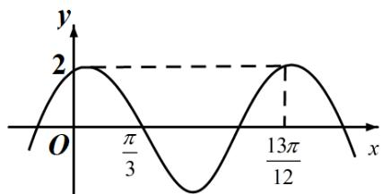

<!-- question-source:start -->
15.已知函数 $f(x) = 2\cos (\omega x + \varphi)$ 的部分图像如图所示，则 $f(\frac{\pi}{2}) =$ \_\_\_\_.

<!-- question-source:end -->

![[高中/真题/按年份分类/2021/2021年全国统一高考数学试卷_文科__全国甲卷__含解析版_/填空题/题目/answers/Q00022189A1.md]]
