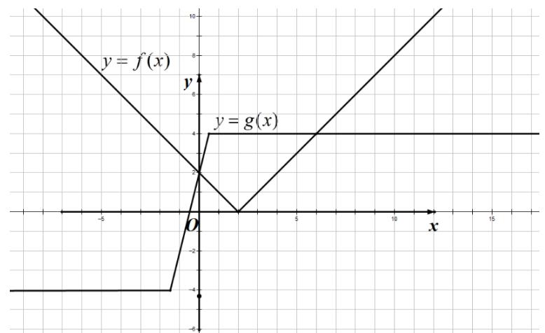

> [!faq]- 2021年全国统一高考数学试卷（文科）（全国甲卷）（含解析版）解析
>
> > [!success]- **【答案】** 见解析；
>
> > [!note]- **【分析】**
> > 本题未单列分析。
>
> > [!note]- **【解析】**
> > $$
> > f (x) = \left\{ \begin{array}{l} x - 2, x \geq 2 \\ 2 - x, x <   2 \end{array} ; \right. \tag {1}
> > $$
> >
> > $$
> > g (x) = \left\{ \begin{array}{l} - 4, x \leq - \frac {3}{2} \\ 4 x + 2, - \frac {3}{2} <   x <   \frac {1}{2} \\ 4, x \geq \frac {1}{2} \end{array} \right.
> > $$
> >
> > 
> > (2) 当 $a \leq 0$ 时，恒不满足，此时 $f(2 - a + a) = 0 < g(2 - a) = 4$ ；
> >
> > 当 $a > 0$ 时， $f(x + a) \geq g(x)$ 恒成立，必有
> >
> > $$
> > f \left(\frac {1}{2} + a\right) \geq g \left(\frac {1}{2}\right) \Leftrightarrow | a - \frac {3}{2} | \geq 4 \Rightarrow a \geq \frac {1 1}{2}.
> > $$
> >
> > 当 $a \geq \frac{11}{2}$ 时，
> >
> > $x \in (-\infty, \frac{3}{2})$ 时， $g(x) \leq 0$ ， $f(x) \geq 0$ ，所以 $f(x) \geq g(x)$ .
> >
> > $x\in [-\frac{3}{2},\frac{1}{2} ]$ 时， $g(x) = 4x + 2$ ， $f(x) = x + a - 2$ ，令
> >
> > $F(x)=f(x)-g(x)=-3x+a-4$ ，所以 $F(x)\geq F(\frac{1}{2})=a-\frac{11}{2}\geq0$
> >
> > $x \in \left(\frac{1}{2}, +\infty\right)$ 时， $f(x) = x + a - 2$ ， $g(x) = 4$ 。
> >
> > $F(x)=f(x)-g(x)=x+a-6$ ，所以 $F(x)>F(\frac{1}{2})\geq0$
> >
> > 所以， $a\in[\frac{11}{2},+\infty)$
