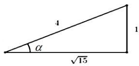

> [!faq]- 2021年全国统一高考数学试卷（文科）（全国甲卷）（含解析版）解析
>
> > [!success]- **【答案】** A
>
> > [!note]- **【分析】**
> > 本题未单列分析。
>
> > [!note]- **【解析】**
> > $\tan 2\alpha = \frac{\cos\alpha}{2 - \sin\alpha}$
> >
> > $\tan 2\alpha = \frac{2\tan\alpha}{1 - \tan^2\alpha} = \frac{2\sin\alpha\cos\alpha}{\cos^2\alpha - \sin^2\alpha} = \frac{\cos\alpha}{2 - \sin\alpha}$ $\therefore 2\sin \alpha (2 - \sin \alpha) = \cos^2\alpha - \sin^2\alpha$ $\therefore 4\sin \alpha - 2\sin^2\alpha = \cos^2\alpha - \sin^2\alpha = 1 - 2\sin^2\alpha$ $\therefore \sin \alpha = \frac{1}{4}$ .
> >
> > 又∵ $\alpha\in(0,\frac{\pi}{2})$ . 如图， $\tan\alpha=\frac{1}{\sqrt{15}}=\frac{\sqrt{15}}{15}$ .
> >
> > 
