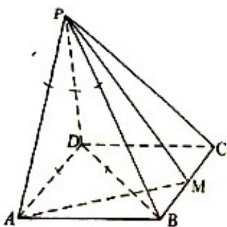

<!-- question-source:start -->
18.如图，四棱锥 $P - ABCD$ 的底面是矩形， $PD \perp$ 底面 $ABCD$ ， $M$ 为 $BC$ 的中点，且 $PB \perp AM$ .

(1) 证明: 平面 $PAM \perp$ 平面 $PBD$ ;

(2) 若 $PD = DC = 1$ ，求四棱锥 $P - ABCD$ 的体积.

<!-- question-source:end -->

![[高中/真题/按年份分类/2021/2021年全国统一高考数学试卷_文科__新课标ⅰ__含解析版_/填空题/题目/answers/Q00022478A1.md]]
