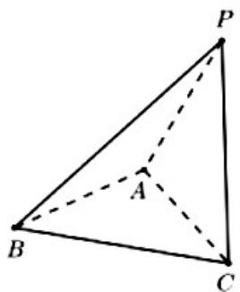
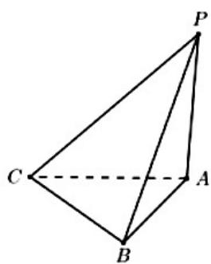

> [!faq]- 2021年全国统一高考数学试卷（文科）（新课标ⅰ）（含解析版）解析
>
> > [!success]- **【答案】** ②⑤或③④
>
> > [!note]- **【分析】**
> > 本题未单列分析。
>
> > [!note]- **【解析】**
> > 由高度可知，侧视图只能为②或③.
> >
> > 侧视图为②, 如图(1), 平面 $PAC \perp$ 平面 ABC, $PA = PC = \sqrt{2}$ , BA = BC = $\sqrt{5}$ , AC = 2,
> >
> > 俯视图为⑤.
> >
> > 俯视图为③, 如图 (2), $PA \perp$ 平面 $ABC$ , $PA = 1$ , $AC = AB = \sqrt{5}$ , $BC = 2$ , 俯视图为④.
> >
> >   
> > (1)
> >
> >   
> > (2)
