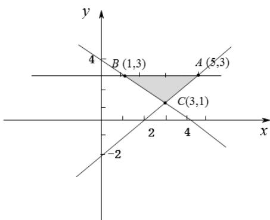

> [!faq]- 2021年全国统一高考数学试卷（文科）（新课标ⅰ）（含解析版）解析
>
> > [!success]- **【答案】** C
>
> > [!note]- **【分析】**
> > 本题未单列分析。
>
> > [!note]- **【解析】**
> > 根据约束条件可得图像如下， $z = 3x + y$ 的最小值，即 $y = -3x + z$ ， $y$ 轴截距最小值.根据图
> >
> > 像可知 $y = -3x + z$ 过点 $B(1,3)$ 时满足题意，即 $z_{\mathrm{min}} = 3 + 3 = 6$
> >
> > 
> > 6. $\cos^2\frac{\pi}{12} -\cos^2\frac{5\pi}{12} = ()$ A. $\frac{1}{2}$ B. $\frac{\sqrt{3}}{3}$ C. $\frac{\sqrt{2}}{2}$ D. $\frac{\sqrt{3}}{2}$
