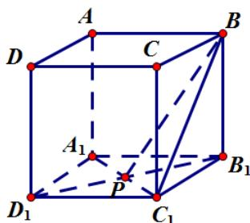

> [!faq]- 2021年全国统一高考数学试卷（文科）（新课标ⅰ）（含解析版）解析
>
> > [!success]- **【答案】** D
>
> > [!note]- **【分析】**
> > 本题未单列分析。
>
> > [!note]- **【解析】**
> > 做出图形， $AD_{1} / / BC_{1}$ ，所以 $\angle PBC_{1}$ 为异面直线所成角，设棱长为 $1$
> >
> > $$
> > B C _ {1} = \sqrt {2}, B _ {1} P = \frac {\sqrt {2}}{2}, P C _ {1} = \frac {\sqrt {2}}{2}, B P = \frac {\sqrt {6}}{2}.
> > $$
> >
> > $\cos \angle PBC_{1} = \frac{BC_{1}^{2} + BP^{2} - C_{1}P^{2}}{2BP\cdot BC_{1}} = \frac{2 + \frac{3}{2} - \frac{1}{2}}{2\times\frac{\sqrt{6}}{2}\times\sqrt{2}} = \frac{\sqrt{3}}{2}$ ，即 $\angle PBC_{1} = \frac{\pi}{6}$ ，故选D.
> >
> > 
