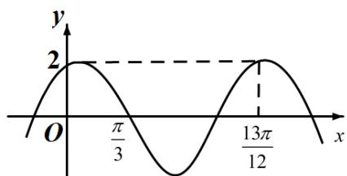

<!-- question-source:start -->
16.已知函数 $f(x) = 2\cos (\omega x + \varphi)$ 的部分图像如图所示，则满足条件

$(f(x)-f(-\frac{7\pi}{4}))(f(x)-f(\frac{4\pi}{3}))>0$ 的最小正整数 x 为 \_\_\_\_.

<!-- question-source:end -->

![[高中/真题/按年份分类/2021/2021年全国统一高考数学试卷_理科__全国甲卷__含解析版_/填空题/题目/answers/Q00022258A1.md]]
