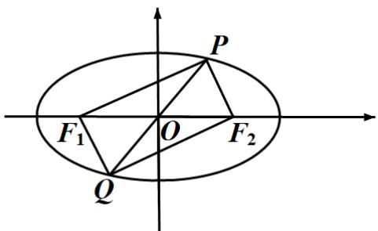

> [!faq]- 2021年全国统一高考数学试卷（理科）（全国甲卷）（含解析版）解析
>
> > [!success]- **【答案】** 8
>
> > [!note]- **【分析】**
> > 本题未单列分析。
>
> > [!note]- **【解析】**
> > 如图，由 $|PQ| \neq F_1F_2|$ 及椭圆对称性可知，四边形 $PF_{1}QF_{2}$ 为矩形.
> >
> > 设 $|PF_{1}| = m$ ， $|PF_{2}| = n$ ，则 $\left\{ \begin{array}{l} m + n = 8① \\ m^{2} + n^{2} = |F_{1}F_{2}|^{2} = 48② \end{array} \right.$ ， $\frac{①^{2} - ②}{2}$ 得 $2mn = 16$ 。所以，四边形
> >
> > $PF_{1}QF_{2}$ 面积为 mn=8.
> >
> > 
