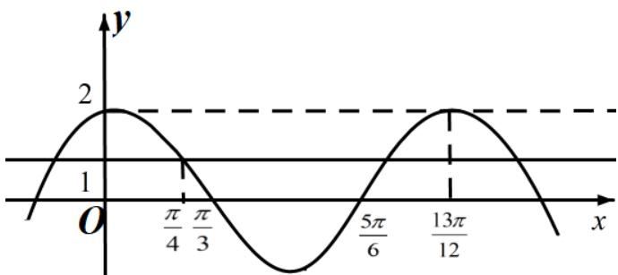

> [!faq]- 2021年全国统一高考数学试卷（理科）（全国甲卷）（含解析版）解析
>
> > [!success]- **【答案】** 2
>
> > [!note]- **【分析】**
> > 本题未单列分析。
>
> > [!note]- **【解析】**
> > 由图可知， $f(x)$ 的最小正周期 $T = \frac{4}{3}\times (\frac{13}{12}\pi -\frac{\pi}{3}) = \pi$ ， $\therefore \omega = 2$
> >
> > $$
> > \because f \left(\frac {1 3 \pi}{1 2}\right) = 2, \therefore 2 \cos \left(\frac {1 3 \pi}{6} + \varphi\right) = 2, \therefore \varphi = - \frac {\pi}{6} + 2 k \pi , k \in Z.
> > $$
> >
> > $$
> > \therefore f (x) = 2 \cos \left(2 x - \frac {\pi}{6}\right), \quad \therefore f \left(\frac {4 \pi}{3}\right) = 0, \quad f \left(- \frac {7 \pi}{4}\right) = 1.
> > $$
> >
> > $$
> > \therefore (f (x) - 1) (f (x) - 0) > 0 \Leftrightarrow f (x) <   0 \text {或} f (x) <   1.
> > $$
> >
> > 结合图像可知，满足 $f(x) > 1$ 的离 $y$ 轴最近的正数区间 $\subseteq (0, \frac{\pi}{4})$ ，无正数；
> >
> > $f(x) < 0$ 的离 $y$ 轴最近的正数区间为 $\left(\frac{\pi}{3}, \frac{5\pi}{6}\right)$ ，最小正整数 $x = 2$ 。
> >
> > 
