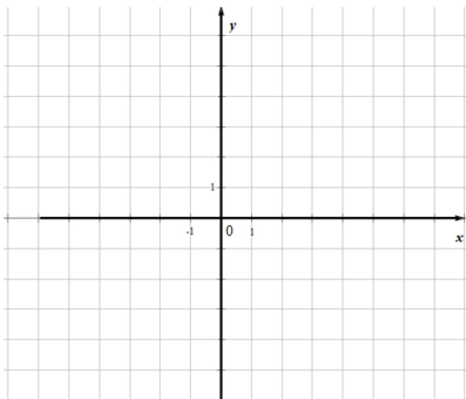

<!-- question-source:start -->
23. 已知函数 $f(x) \neq |x - 2|$ ， $g(x) \neq |2x + 3| - |2x - 1|$ .

(1) 画出 $y = f(x)$ 和 $y = g(x)$ 的图象；

(2) 若 $f(x + a) \geq g(x)$ ，求 $a$ 的取值范围.

<!-- question-source:end -->

![[高中/真题/按年份分类/2021/2021年全国统一高考数学试卷_理科__全国甲卷__含解析版_/解答题/题目/answers/Q00022265A1.md]]
