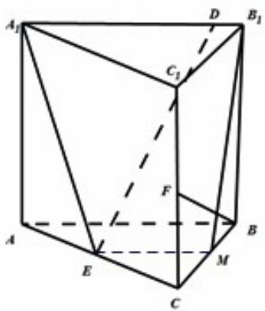
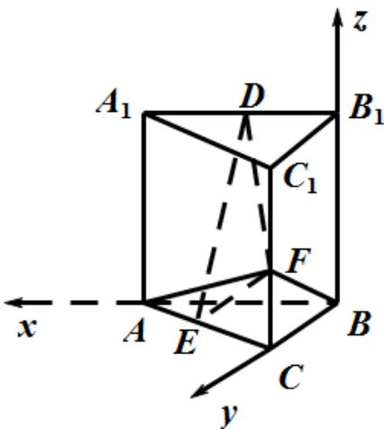

> [!faq]- 2021年全国统一高考数学试卷（理科）（全国甲卷）（含解析版）解析
>
> > [!success]- **【答案】** 见解析；
>
> > [!note]- **【分析】**
> > 本题未单列分析。
>
> > [!note]- **【解析】**
> > (1)
> >
> > 连 $A_{1}E$ ，取 $BC$ 中点 $M$ 连 $B_{1}M$ ， $EM$ ，
> >
> > 由 $EM$ 为 $AC$ ， $BC$ 的中点，则 $EM // AB$ ，
> >
> > 又 $AB // A_{1}B_{1}$ ， $A_{1}B_{1} // EM$ ，则 $A_{1}B_{1}ME$ 共面，故 $DE \subset$ 面 $A_{1}B_{1}ME$ 。
> >
> > 又在侧面 $BCC_{1}B_{1}$ 中 $\Delta FCB\simeq \Delta MBB_{1}$ ，则 $BF\perp MB_{1}$
> >
> > $\left. \begin{array}{l} BF \perp A_{1}B_{1} \\ MB_{1} \cap A_{1}B_{1} = B_{1} \\ MB_{1}, A_{1}B_{1} \subset \text{面} A_{1}B_{1}ME \end{array} \right\} \Rightarrow BF \perp \text{面} A_{1}B_{1}ME$ 又，则 $BF \perp DE$
> >
> > 
> > (2) $BF \perp A_{1}B_{1}$ ，则 $BF \perp AB \Rightarrow AF^{2} = BF^{2} + AB^{2} = 9$ .
> >
> > 又 $AF^{2}=FC^{2}+AC^{2}\Rightarrow AC^{2}=8$ 则 $AB\perp BC$ .
> >
> > 如图以 B 为原点建立坐标轴，则 $B(0,0,0)$ ， $C(0,2,0)$ ， $A(2,0,0)$ ， $E(1,1,0)$ ，
> >
> > $F(0,2,1)$
> >
> > 
> >
> > 设 $DB_{1} = t$ 则 $D(t,0,2),0\leq t\leq 2$
> >
> > 则面 $BCC_{1}B_{1}$ 法向量为 $m = (1,0,0)$ ，对面 $DEF$ 设法向量为 $n = (x,y,z)$ ，则
> >
> > $$
> > \left\{ \begin{array}{l} E F = (- 1, 1, 1) \\ E D = (t - 1, - 1, 2) \end{array} , \quad \left\{ \begin{array}{l} E F \cdot n = 0 \\ E D \cdot n = 0 \end{array} \Rightarrow n = (3, 1 + t, 2 - t) \right. \right.
> > $$
> >
> > 则
> >
> > $$
> > \cos \left\langle \stackrel {\leftrightarrow} {m}, n \right\rangle = \frac {3}{\sqrt {3 ^ {2} + (1 + t) ^ {2} + (2 - t) ^ {2}}} = \frac {3}{\sqrt {2 t ^ {2} - 2 t + 1 4}}
> > $$
> >
> > 要求最小正弦值则求最大余弦值.
> >
> > 当 $t = \frac{1}{2}$ 时二面角余弦值最大，则 $B_{1}D = \frac{1}{2}$ 时二面角正弦值最小.
