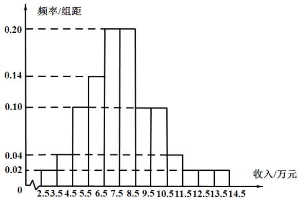

<!-- question-source:start -->
2. 为了解某地农村经济情况，对该地农户家庭年收入进行抽样调查，将农户家庭年收入的

调查数据整理得到如下频率分布直方图：

根据此频率分布直方图，下面结论不正确的是（）
A.该地农户家庭年收入低于4.5万元的农户比率估计为6%
B.该地农户家庭年收入不低于10.5万元的农户比率估计为10%
C.估计该地农户家庭年收入的平均值不超过6.5万元
D.估计该地有一半以上的农户，其家庭年收入介于4.5万元至8.5万元之间
<!-- question-source:end -->

![[高中/真题/按年份分类/2021/2021年全国统一高考数学试卷_理科__全国甲卷__含解析版_/选择题/题目/answers/Q00022244A1.md]]
