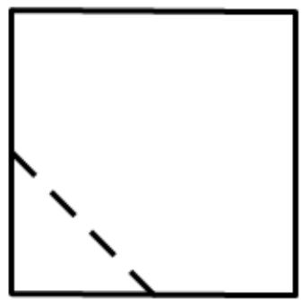
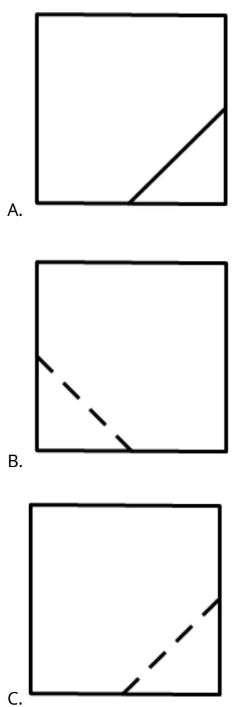
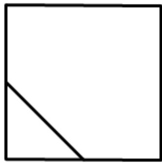

<!-- question-source:start -->
6.在一个正方体中，过顶点 $A$ 的三条棱的中点分别为 $E$ ， $F$ ， $G$ ，该正方体截去三棱锥 $A - EFG$ 后，所得多面体的三视图中，正视图如图所示，则相应的侧视图是（）

  
正视图

D.
<!-- question-source:end -->

![[高中/真题/按年份分类/2021/2021年全国统一高考数学试卷_理科__全国甲卷__含解析版_/选择题/题目/answers/Q00022248A1.md]]
