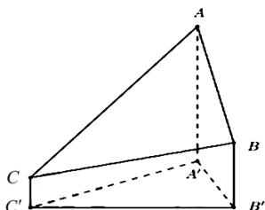

<!-- question-source:start -->
8.2020年12月8日，中国和尼泊尔联合公布珠穆朗玛峰最新高程为 $^{8848.86}$ （单位：m），三角高程测量法是珠峰高程测量方法之一．右图是三角高程测量法的一个示意图，现有A，B，C三点，且A，B，C在同一水平面上的投影 $A'$ ， $B'$ ， $C'$ 满足 $\angle A'C'B'=45^{\circ}$ ， $\angle A'B'C'=60^{\circ}$ ．由C点测得B点的仰角为 $15^{\circ}$ ， $BB'$ 与 $CC'$ 的差为100：由B点测得A点的仰角为 $45^{\circ}$ ，则A，C两点到水平面 $A'B'C'$ 的高度差 $AA'-CC'$ 约为（）（ $\sqrt{3}\approx1.732$ ）

A.346   
B.373   
C.446   
D.473
<!-- question-source:end -->

![[高中/真题/按年份分类/2021/2021年全国统一高考数学试卷_理科__全国甲卷__含解析版_/选择题/题目/answers/Q00022250A1.md]]
