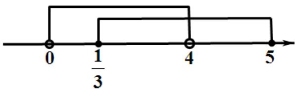

> [!faq]- 2021年全国统一高考数学试卷（理科）（全国甲卷）（含解析版）解析
>
> > [!success]- **【答案】** B
>
> > [!note]- **【分析】**
> > 本题未单列分析。
>
> > [!note]- **【解析】**
> > 由图知， $M\cap N = \{x\mid \frac{1}{3}\leq x <   4\}$
> >
> > 
