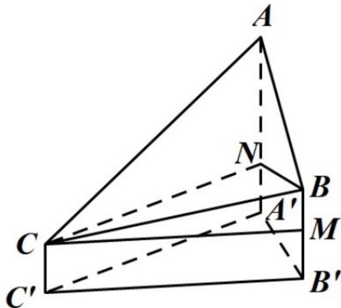

> [!faq]- 2021年全国统一高考数学试卷（理科）（全国甲卷）（含解析版）解析
>
> > [!success]- **【答案】** B
>
> > [!note]- **【分析】**
> > 本题未单列分析。
>
> > [!note]- **【解析】**
> > 过 C 作 $BB'$ 的垂线交 $BB'$ 于点 M，过 B 作 $AA'$ 的垂线交 $AA'$ 于点 N，
> >
> > 由题意得 $BM = 100$ ， $\angle BCM = 15^{\circ}$ ， $\angle ABN = 45^{\circ}$ ，即 $CM = \frac{100}{\tan 15^{\circ}} = B'C'$
> >
> > 所以
> >
> > $$
> > B N = B ^ {\prime} A ^ {\prime} = \frac {B ^ {\prime} C ^ {\prime} \sin 4 5 ^ {\circ}}{\sin 7 5 ^ {\circ}} = \frac {\frac {1 0 0}{\tan 1 5 ^ {\circ}} \cdot \frac {\sqrt {2}}{2}}{\sin 7 5 ^ {\circ}} = \frac {5 0 \sqrt {2}}{\sin 1 5 ^ {\circ}},
> > $$
> >
> > 所以
> >
> > $$
> > A N = B N = \frac {5 0 \sqrt {2}}{\sin 1 5 ^ {\circ}} = \frac {5 0 \sqrt {2}}{\frac {\sqrt {6} - \sqrt {2}}{4}} = 2 7 3
> > $$
> >
> > 4 . 得 A，C 两点到水平面 $A'B'C'$ 的高度差 $AA'-CC'$ 约为 $273+100=373$ ，故选 B。
> >
> > 
