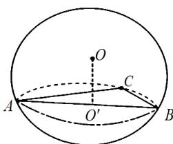

> [!faq]- 2021年全国统一高考数学试卷（理科）（全国甲卷）（含解析版）解析
>
> > [!success]- **【答案】** A
>
> > [!note]- **【分析】**
> > 本题未单列分析。
>
> > [!note]- **【解析】**
> > 记 $O'$ 为 A, B, C 所在圆面的圆心，则 $OO' \perp ABC$ .
> >
> > 
> >
> > 又 $AB = \sqrt{2}$ ，所以
> >
> > $$
> > O O ^ {\prime} = \sqrt {O A ^ {2} - A O ^ {\prime 2}} = \sqrt {1 ^ {2} - (\frac {\sqrt {2}}{2}) ^ {2}} = \frac {\sqrt {2}}{2}
> > $$
> >
> > 所以 $V_{O-ABC}=\frac{1}{3}\cdot S_{\triangle ABC}\cdot OO'=\frac{1}{3}\times\frac{1}{2}\times1\times1\times\frac{\sqrt{2}}{2}=\frac{\sqrt{2}}{12}$ . 故选 A.
