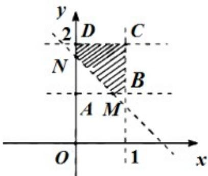

> [!faq]- 2021年全国统一高考数学试卷（理科）（新课标ⅰ）解析
>
> > [!success]- **【答案】** B
>
> > [!note]- **【分析】**
> > 本题未单列分析。
>
> > [!note]- **【解析】**
> > 由题意记 $x \in (0,1)$ ， $y \in (1,2)$ ，题目即求 $x + y > \frac{7}{4}$ 的概率，绘图如下所示.
> >
> > $$
> > P = \frac {S _ {\text {阴}}}{S _ {\text {正} A B C D}} = \frac {1 \times 1 - \frac {1}{2} A M \cdot A N}{1 \times 1} = \frac {1 - \frac {1}{2} \times \frac {3}{4} \times \frac {3}{4}}{1} = \frac {2 3}{3 2}.
> > $$
> >
> > 
