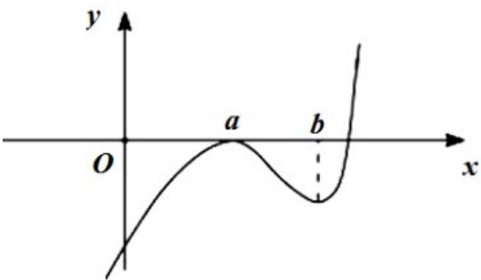
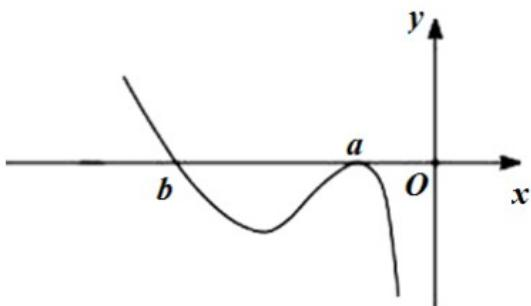

> [!faq]- 2021年全国统一高考数学试卷（理科）（新课标ⅰ）解析
>
> > [!success]- **【答案】** D
>
> > [!note]- **【分析】**
> > 本题未单列分析。
>
> > [!note]- **【解析】**
> > 若 a > 0，其图像如图（1），此时，0 < a < b；若 a < 0，时图像如图（2），此时，b < a < 0。
> >
> > 综上， $ab < a^2$
> >
> > 
> >
> > 
