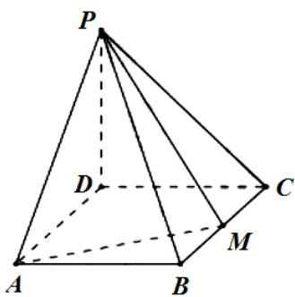
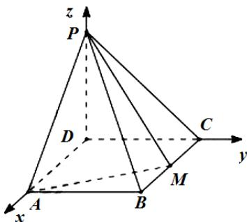

<!-- question-source:start -->
18.如图，四棱锥 $P - ABCD$ 的底面是矩形， $PD \perp$ 底面 $ABCD$ ， $PD = DC = 1, M$ 为 $BC$ 的中点，且 $PB \perp AM$ .

(1) 求 BC ;

(2) 求二面角 $A - PM - B$ 的正弦值.

<!-- question-source:end -->

![[高中/真题/按年份分类/2021/2021年全国统一高考数学试卷_理科__新课标ⅰ_/二_填空题/题目/answers/Q00021913A1.md]]
