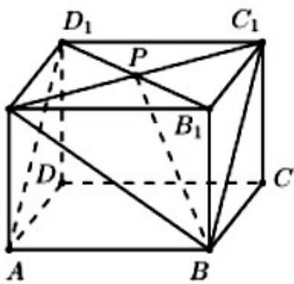

<!-- question-source:start -->
5.在正方体 $ABCD - A_{1}B_{1}C_{1}D_{1}$ 中， $P$ 为 $B_{1}D_{1}$ 的中点，则直线 $PB$ 与 $AD_{1}$ 所成的角为（）A. $\frac{\pi}{2}$

B. $\frac{\pi}{3}$ C. $\frac{\pi}{4}$ D. $\frac{\pi}{6}$

$A_{1}$

<!-- question-source:end -->

![[高中/真题/按年份分类/2021/2021年全国统一高考数学试卷_理科__新课标ⅰ__含解析版_/选择题/题目/answers/Q00021900A1.md]]
