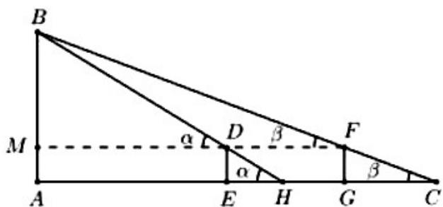

> [!faq]- 2021年全国统一高考数学试卷（理科）（新课标ⅰ）（含解析版）解析
>
> > [!success]- **【答案】** A
>
> > [!note]- **【分析】**
> > 本题未单列分析。
>
> > [!note]- **【解析】**
> > 连接 $DF$ 交 $AB$ 于 $M$ ，则 $AB = AM + BM$ ：
> >
> > 记 $\angle BDM = \alpha$ ， $\angle BFM = \beta$ ，则 $\frac{MB}{\tan\beta} -\frac{MB}{\tan\alpha} = MF - MD = DF\cdot$
> >
> > 而 $\tan \beta = \frac{FG}{GC}$ ， $\tan \alpha = \frac{ED}{EH}$ .所以
> >
> > $$
> > \frac {M B}{\tan \beta} - \frac {M B}{\tan \alpha} = M B \left(\frac {1}{\tan \beta} - \frac {1}{\tan \alpha}\right) = M B \cdot \left(\frac {G C}{F G} - \frac {E H}{E D}\right) = M B \cdot \frac {G C - E H}{E D}.
> > $$
> >
> > 故 $MB = \frac{ED \cdot DF}{GC - EH} = \frac{\text{表高} \times \text{表距}}{\text{表目距的差}}$ ，所以高 $AB = \frac{\text{表高} \times \text{表距}}{\text{表目距的差}} + \text{表高} \cdot$
> >
> > 
