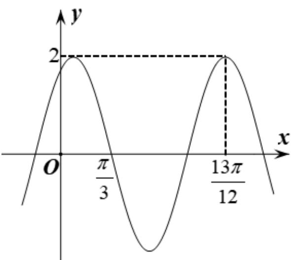

<!-- question-source:start -->
15. 已知函数 $f(x)=2\cos(\omega x+\varphi)$ 的部分图像如图所示，则 $f\left(\frac{\pi}{2}\right)=$ \_\_\_\_.

<!-- question-source:end -->

![[高中/真题/按年份分类/2021/2021年全国高考甲卷数学_文_试题_解析版_/填空题/题目/answers/Q00021002A1.md]]
