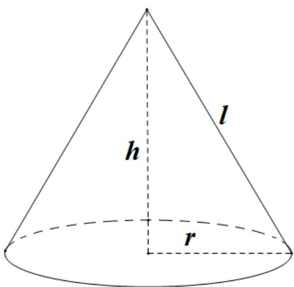

> [!faq]- 2021年全国高考甲卷数学（文）试题（解析版）解析
>
> > [!success]- **【答案】** $39\pi$
>
> > [!note]- **【分析】**
> > 利用体积公式求出圆锥的高，进一步求出母线长，最终利用侧面积公式求出答案.
>
> > [!note]- **【解析】**
> > $\because V=\frac{1}{3}\pi6^{2}\cdot h=30\pi$
> >
> > $$
> > \therefore h = \frac {5}{2}
> > $$
> >
> > $$
> > \therefore l = \sqrt {h ^ {2} + r ^ {2}} = \sqrt {\left(\frac {5}{2}\right) ^ {2} + 6 ^ {2}} = \frac {1 3}{2}
> > $$
> >
> > $$
> > \therefore S _ {\text {侧}} = \pi r l = \pi \times 6 \times \frac {1 3}{2} = 3 9 \pi .
> > $$
> >
> > 故答案为： $39\pi$
> >
> > 
