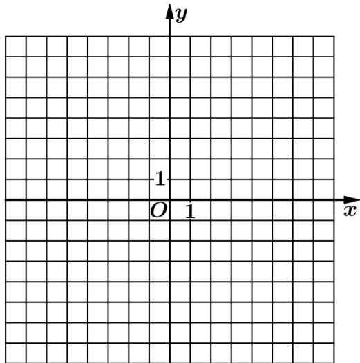

<!-- question-source:start -->
23. 已知函数 $f(x) = |x - 2|$ , $g(x) = |2x + 3| - |2x - 1|$ .

(1) 画出 $y = f(x)$ 和 $y = g(x)$ 的图像；

(2) 若 $f(x + a) \geq g(x)$ ，求 $a$ 的取值范围.

【
<!-- question-source:end -->

![[高中/真题/按年份分类/2021/2021年全国高考甲卷数学_文_试题_解析版_/解答题/题目/answers/Q00021895A1.md]]
