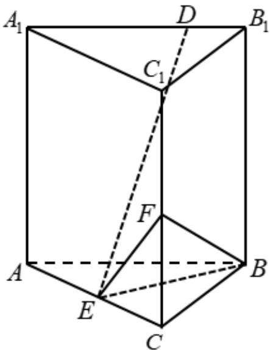

<!-- question-source:start -->
19. 已知直三棱柱 $ABC - A_{1}B_{1}C_{1}$ 中，侧面 $AA_{1}B_{1}B$ 为正方形，AB = BC = 2，E，F 分别为 AC 和 $CC_{1}$ 的中点， $BF \perp A_{1}B_{1}$ .

(1) 求三棱锥 $F - EBC$ 的体积;
<!-- question-source:end -->

![[高中/真题/按年份分类/2021/2021年全国高考甲卷数学_文_试题_解析版_/解答题/题目/answers/Q00031329A1.md]]
