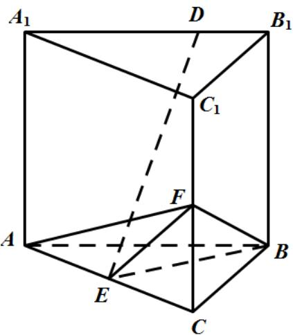
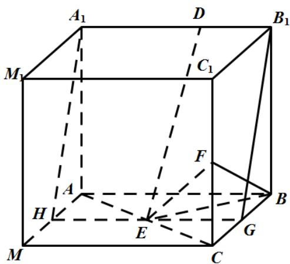

> [!faq]- 2021年全国高考甲卷数学（文）试题（解析版）解析
>
> > [!success]- **【答案】** (1) $\frac{1}{3}$ ; (2)证明见
>
> > [!note]- **【分析】**
> > (1)首先求得 AC 的长度，然后利用体积公式可得三棱锥的体积；
> > (2)将所给的几何体进行补形，从而把线线垂直的问题转化为证明线面垂直，然后再由线面垂直可得题中的结论.
>
> > [!note]- **【解析】**
> > (1)如图所示，连结 $AF$ ，
> >
> > 
> >
> > 由题意可得： $BF = \sqrt{BC^{2} + CF^{2}} = \sqrt{4 + 1} = \sqrt{5}$
> >
> > 由于 $AB \perp BB_{1}$ , $BC \perp AB$ , $BB_{1} \cap BC = B$ , 故 $AB \perp$ 平面 $BCC_{1}B_{1}$ ,
> >
> > 而 $BF \subset$ 平面 $BCC_{1}B_{1}$ ，故 $AB \perp BF$ ，
> >
> > 从而有 $AF = \sqrt{AB^{2} + BF^{2}} = \sqrt{4 + 5} = 3$ ,
> >
> > 从而 $AC = \sqrt{AF^{2} - CF^{2}} = \sqrt{9 - 1} = 2\sqrt{2}$ ,
> >
> > 则 $AB^{2} + BC^{2} = AC^{2},\therefore AB\perp BC$ ， $\triangle ABC$ 为等腰直角三角形，
> >
> > $$
> > S _ {\triangle B C E} = \frac {1}{2} s _ {\triangle A B C} = \frac {1}{2} \times \left(\frac {1}{2} \times 2 \times 2\right) = 1, V _ {F - E B C} = \frac {1}{3} \times S _ {\triangle B C E} \times C F = \frac {1}{3} \times 1 \times 1 = \frac {1}{3}.
> > $$
> > (2)由
> > (1) 结论可将几何体补形为一个棱长为 2 的正方体 $ABCM - A_1B_1C_1M_1$ ，如图所示，取棱 $AM, BC$ 的中点 $H, G$ ，连结 $A_1H, HG, GB_1$ ，
> >
> > 
> >
> > 正方形 $BCC_{1}B_{1}$ 中，G,F 为中点，则 $BF\perp B_{1}G$
> >
> > 又 $BF\perp A_1B_1,A_1B_1\cap B_1G = B_1$
> >
> > 故 $BF \perp$ 平面 $A_{1}B_{1}GH$ ，而 $DE \subset$ 平面 $A_{1}B_{1}GH$ ，
> >
> > 从而 $BF \perp DE$ .
> >
> > 【点睛】求三棱锥的体积时要注意三棱锥的每个面都可以作为底面，例如三棱锥的三条侧棱两两垂直，我们就选择其中的一个侧面作为底面，另一条侧棱作为高来求体积．对于空间中垂直关系（线线、线面、面面）的证明经常进行等价转化.
