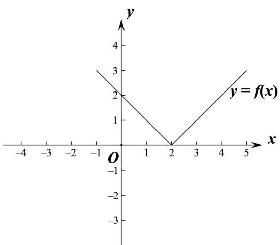
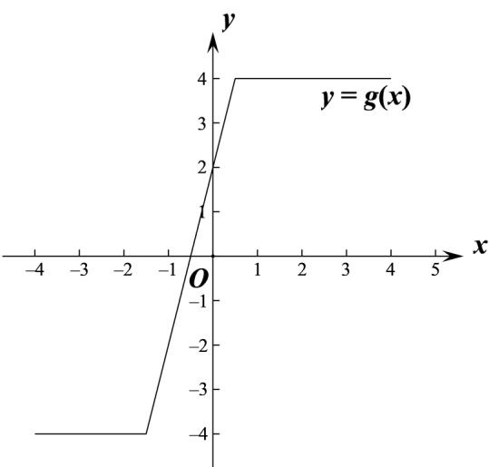
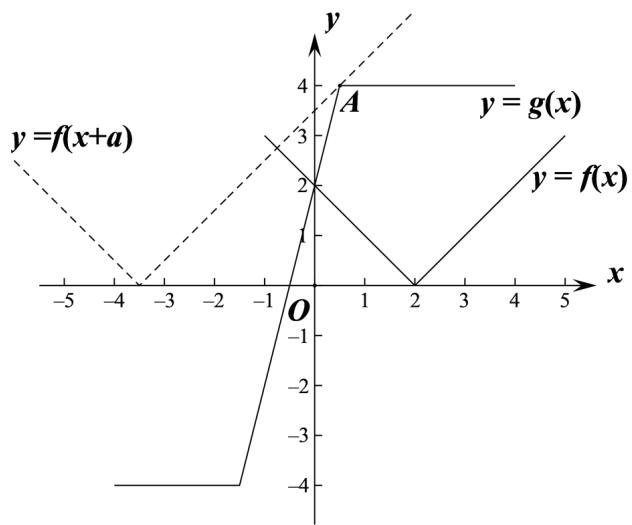

> [!faq]- 2021年全国高考甲卷数学（文）试题（解析版）解析
>
> > [!success]- **【答案】** （1）图像见解析； （2） $a \geq \frac{11}{2}$
>
> > [!note]- **【分析】**
> > （1）分段去绝对值即可画出图像；
> > (2) 根据函数图像数形结和可得需将 $y = f(x)$ 向左平移可满足同角，求得 $y = f(x + a)$ 过 $A\left(\frac{1}{2}, 4\right)$ 时 $a$ 的值可求.
>
> > [!note]- **【解析】**
> > （1）可得 $f(x)=|x-2|=\begin{cases}2-x,x<2\\x-2,x\geq2\end{cases}$ ，画出图像如下：
> >
> > 
> >
> > $g(x)=\left|2x+3\right|-\left|2x-1\right|=\begin{cases}-4,x<-\frac{3}{2}\\4x+2,-\frac{3}{2}\leq x<\frac{1}{2}\end{cases}$ ，画出函数图像如下：
> >
> > 
> > (2) $f(x + a) = |x + a - 2|$ ,
> >
> > 如图，同一个坐标系里画出 $f(x), g(x)$ 图像，
> >
> > $y = f(x + a)$ 是 $y = f(x)$ 平移了 $|a|$ 个单位得到，
> >
> > 则要使 $f(x+a)\geq g(x)$ ，需将 $y=f(x)$ 向左平移，即 a>0，
> >
> > 当 $y = f(x + a)$ 过 $A\left(\frac{1}{2},4\right)$ 时， $\left|\frac{1}{2} +a - 2\right| = 4$ ，解得 $a = \frac{11}{2}$ 或 $-\frac{5}{2}$ （舍去），
> >
> > 则数形结合可得需至少将 $y = f(x)$ 向左平移 $\frac{11}{2}$ 个单位， $\therefore a \geq \frac{11}{2}$ .
> >
> > 
> >
> > 【点睛】关键点睛：本题考查绝对值不等式的恒成立问题，解题的关键是根据函数图像数形结合求解.
