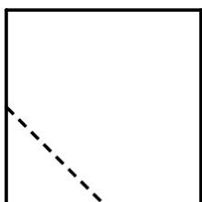
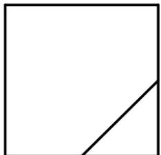
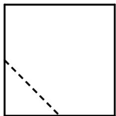
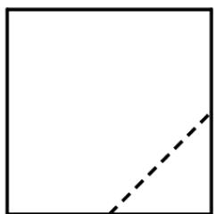
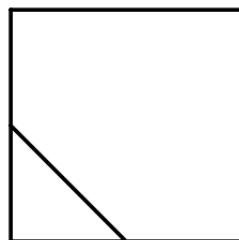

<!-- question-source:start -->
6. 在一个正方体中, 过顶点 $A$ 的三条棱的中点分别为 $E, F, G$ . 该正方体截去三棱锥 $A - EFG$ 后, 所得多面体的三视图中, 正视图如图所示, 则相应的侧视图是 ( )

  
正视图

A.

B.

C.

D.

【
<!-- question-source:end -->

![[高中/真题/按年份分类/2021/2021年全国高考甲卷数学_理_试题_解析版_/选择题/题目/answers/Q00022489A1.md]]
