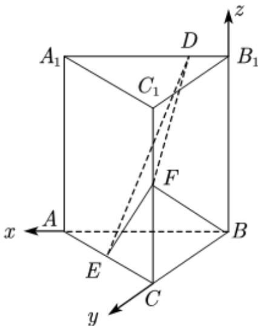

> [!faq]- 2021年全国高考甲卷数学（理）试题（解析版）解析
>
> > [!success]- **【答案】** . 【
>
> > [!note]- **【分析】**
> > 通过已知条件, 确定三条互相垂直的直线, 建立合适的空间直角坐标系, 借助空间向量证明线线垂直和求出二面角的平面角的余弦值最大, 进而可以确定出
>
> > [!note]- **【解析】**
> > 因为三棱柱 $ABC - A_{1}B_{1}C_{1}$ 是直三棱柱，所以 $BB_{1} \perp$ 底面 ABC，所以 $BB_{1} \perp AB$
> >
> > 因为 $A_{1}B_{1}//AB$ ， $BF\perp A_{1}B_{1}$ ，所以 $BF\perp AB$ ，
> >
> > 又 $BB_{1}\cap BF = B$ ，所以 $AB\bot$ 平面 $BCC_{1}B_{1}$
> >
> > 所以 $BA, BC, BB_{1}$ 两两垂直.
> >
> > 以 $B$ 为坐标原点，分别以 $BA, BC, BB_{1}$ 所在直线为 $x, y, z$ 轴建立空间直角坐标系，如图.
> >
> > 
> >
> > 所以 $B(0,0,0)$ , $A(2,0,0)$ , $C(0,2,0)$ , $B_{1}(0,0,2)$ , $A_{1}(2,0,2)$ , $C_{1}(0,2,2)$ ,
> >
> > $$
> > E (1, 1, 0), F (0, 2, 1)
> > $$
> >
> > 由题设 $D(a,0,2)$ $(0\leq a\leq 2)$
