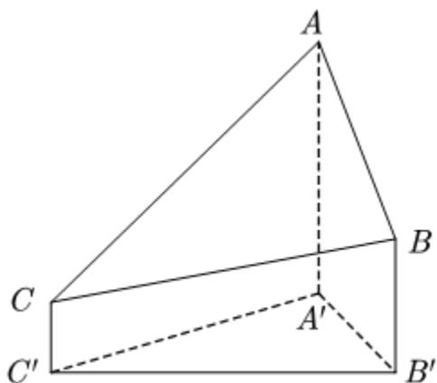
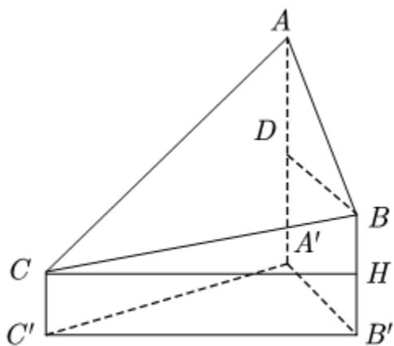

> [!faq]- 2021年全国高考甲卷数学（理）试题（解析版）解析
>
> > [!success]- **【答案】** B 【
>
> > [!note]- **【分析】**
> > 当 $q > 0$ 时，通过举反例说明甲不是乙的充分条件；当 $\left\{S_n\right\}$ 是递增数列时，必有 $a_{n} > 0$ 成立即可说明 $q > 0$ 成立，则甲是乙的必要条件，即可选出
>
> > [!note]- **【解析】**
> > 由题，当数列 $-2,-4,-8,\cdots$ 时，满足 q>0 ，
> >
> > 但是 $\left\{S_{n}\right\}$ 不是递增数列，所以甲不是乙的充分条件.
> >
> > 若 $\left\{S_{n}\right\}$ 是递增数列，则必有 $a_{n} > 0$ 成立，若 $q > 0$ 不成立，则会出现一正一负的情况，是矛盾的，则 $q > 0$ 成立，所以甲是乙的必要条件.
> >
> > 故选：B.
> >
> > 【点睛】在不成立的情况下，我们可以通过举反例说明，但是在成立的情况下，我们必须要给予其证明过程。8.2020年12月8日，中国和尼泊尔联合公布珠穆朗玛峰最新高程为8848.86（单位：m），三角高程测量法是珠峰高程测量方法之一。如图是三角高程测量法的一个示意图，现有A, B, C三点，且A, B, C在同一水平面上的投影 $A', B', C'$ 满足 $\angle A'C'B'=45^\circ$ ， $\angle A'B'C'=60^\circ$ 。由C点测得B点的仰角为 $15^\circ$ ， $BB'$ 与 $CC'$ 的差为100；由B点测得A点的仰角为 $45^\circ$ ，则A, C两点到水平面 $A'B'C'$ 的高度差 $AA'-CC'$ 约为 $(\sqrt{3} \approx 1.732)$ （）
> >
> > 
> >
> > A. 346 B. 373 C. 446 D. 473
> >
> > 【
> >
> > 
> >
> > 过 $C$ 作 $CH \perp BB'$ ，过 $B$ 作 $BD \perp AA'$ ，
> >
> > 故 $AA'-CC'=AA'-(BB'-BH)=AA'-BB'+100=AD+100$
> >
> > 由题，易知 $\triangle ADB$ 为等腰直角三角形，所以 $AD = DB$ 。
> >
> > 所以 $AA'-CC'=DB+100=A'B'+100$
> >
> > 因为 $\angle BCH = 15^{\circ}$ ，所以 $CH = C'B' = \frac{100}{\tan 15^{\circ}}$
> >
> > 在 $\triangle A'B'C'$ 中，由正弦定理得：
> >
> > $$
> > \frac {A ^ {\prime} B ^ {\prime}}{\sin 4 5 ^ {\circ}} = \frac {C ^ {\prime} B ^ {\prime}}{\sin 7 5 ^ {\circ}} = \frac {1 0 0}{\tan 1 5 ^ {\circ} \cos 1 5 ^ {\circ}} = \frac {1 0 0}{\sin 1 5 ^ {\circ}},
> > $$
> >
> > $$
> > \text {而} \sin 1 5 ^ {\circ} = \sin \left(4 5 ^ {\circ} - 3 0 ^ {\circ}\right) = \sin 4 5 ^ {\circ} \cos 3 0 ^ {\circ} - \cos 4 5 ^ {\circ} \sin 3 0 ^ {\circ} = \frac {\sqrt {6} - \sqrt {2}}{4},
> > $$
> >
> > 所以 $A'B'=\frac{100\times4\times\frac{\sqrt{2}}{2}}{\sqrt{6}-\sqrt{2}}=100(\sqrt{3}+1)\approx273$
> >
> > 所以 $AA'-CC'=A'B'+100\approx373$
> >
> > 故选：B.
> >
> > 【点睛】本题关键点在于如何正确将 $AA' - CC'$ 的长度通过作辅助线的方式转化为 $A'B' + 100$ .
