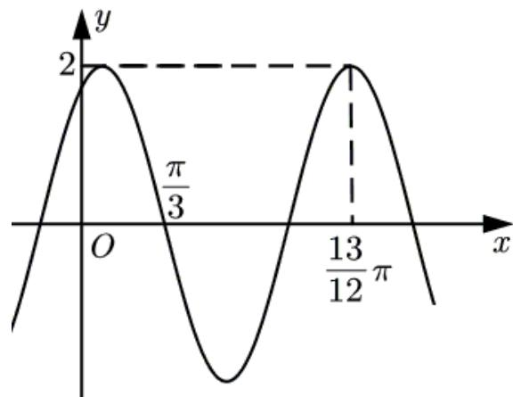

<!-- question-source:start -->
16. 已知函数 $f(x) = 2\cos (\omega x + \varphi)$ 的部分图像如图所示，则满足条件 $\left( f(x) - f\left(-\frac{7\pi}{4}\right)\right)\left( f(x) - f\left(\frac{4\pi}{3}\right)\right) > 0$ 的最小正整数 $x$ 为 \_\_\_\_.

【
<!-- question-source:end -->

![[高中/真题/按年份分类/2021/2021年全国高考甲卷数学_理_试题_解析版_A3/填空题/题目/answers/Q00021934A1.md]]
