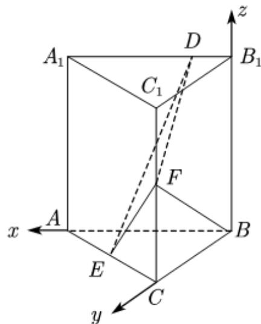

> [!faq]- 2021年全国高考甲卷数学（理）试题（解析版）A3解析
>
> > [!success]- **【答案】** （1）见
>
> > [!note]- **【分析】**
> > 通过已知条件, 确定三条互相垂直的直线, 建立合适的空间直角坐标系, 借助空间向量证明线线垂直和求出二面角的平面角的余弦值最大, 进而可以确定出
>
> > [!note]- **【解析】**
> > 因为三棱柱 $ABC - A_{1}B_{1}C_{1}$ 是直三棱柱，所以 $BB_{1} \perp$ 底面ABC，所以 $BB_{1} \perp AB$
> >
> > 因为 $A_{1}B_{1}//AB$ ， $BF\perp A_{1}B_{1}$ ，所以 $BF\perp AB$ ，
> >
> > 又 $BB_{1} \cap BF = B$ ，所以 $AB \perp$ 平面 $BCC_{1}B_{1}$ .
> >
> > 所以 $BA, BC, BB_{1}$ 两两垂直.
> >
> > 以 $B$ 为坐标原点，分别以 $BA, BC, BB_{1}$ 所在直线为 $x, y, z$ 轴建立空间直角坐标系，如图.
> >
> > 
> >
> > 所以 $B(0,0,0),A(2,0,0),C(0,2,0),B_{1}(0,0,2),A_{1}(2,0,2),C_{1}(0,2,2)$
> >
> > $E(1,1,0),F(0,2,1)$
> >
> > 由题设 $D(a,0,2)$ $(0\leq a\leq 2)$
> > (1) 因为 $BF = (0, 2, 1)$ , DE = (1 - a, 1, -2),
> >
> > 所以 $BF \cdot DE = 0 \times (1 - a) + 2 \times 1 + 1 \times (-2) = 0$ ，所以 $BF \perp DE$ 。
> > (2) 设平面 DFE 的法向量为 $m = (x, y, z)$ ,
> >
> > 因为 $EF = (-1, 1, 1)$ , DE = (1 - a, 1, -2),
> >
> > 所以 $\left\{ \begin{array}{l} m \cdot EF = 0 \\ m \cdot DE = 0 \end{array} \right.$ 即 $\left\{ \begin{array}{l} -x + y + z = 0 \\ (1 - a)x + y - 2z = 0. \end{array} \right.$
> >
> > 令 $z = 2 - a$ ，则 $m = (3,1 + a,2 - a)$
> >
> > 因为平面 $BCC_{1}B_{1}$ 的法向量为 $BA=(2,0,0)$ ,
> >
> > 设平面 $BCC_{1}B_{1}$ 与平面 $DEF$ 的二面角的平面角为 $\theta$
> >
> > $$
> > \text {则} \left| \cos \theta \right| = \frac {\left| m \cdot B A \right|}{\left| m \right| \cdot \left| B A \right|} = \frac {6}{2 \times \sqrt {2 a ^ {2} - 2 a + 1 4}} = \frac {3}{\sqrt {2 a ^ {2} - 2 a + 1 4}}.
> > $$
> >
> > 当 $a = \frac{1}{2}$ 时， $2a^2 - 2a + 4$ 取最小值为 $\frac{27}{2}$ ，此时 $\cos \theta$ 取最大值为 $\frac{3}{\sqrt{\frac{27}{2}}} = \frac{\sqrt{6}}{3}$ 。所以 $(\sin \theta)_{\min} = \sqrt{1 - \left(\frac{\sqrt{6}}{3}\right)^2} = \frac{\sqrt{3}}{3}$ ，此时 $B_1D = \frac{1}{2}$ 。
> >
> > 【点睛】本题考查空间向量的相关计算,能够根据题意设出 $D(a,0,2)$ ( $0 \leq a \leq 2$ ),在第二问中通过余弦值最大,找到正弦值最小是关键一步.
