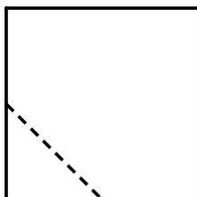
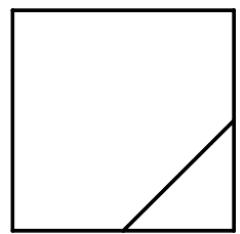

<!-- question-source:start -->
6. 在一个正方体中，过顶点 $A$ 的三条棱的中点分别为 $E, F, G$ . 该正方体截去三棱锥 $A - EFG$ 后，所得多面体的三视图中，正视图如图所示，则相应的侧视图是（）

  
正视图

A.

【
<!-- question-source:end -->

![[高中/真题/按年份分类/2021/2021年全国高考甲卷数学_理_试题_解析版_A3/选择题/题目/answers/Q00021924A1.md]]
