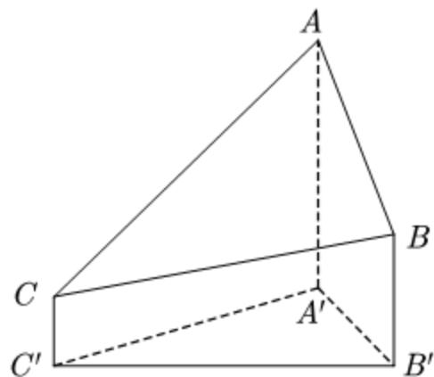

<!-- question-source:start -->
8. 2020 年 12 月 8 日，中国和尼泊尔联合公布珠穆朗玛峰最新高程为 8848.86（单位：m），三角高程测量法是珠峰高程测量方法之一。如图是三角高程测量法的一个示意图，现有 A, B, C 三点，且 A, B, C 在同一水平面上的投影 $A', B', C'$ 满足 $\angle A'C'B'=45^{\circ}$ ， $\angle A'B'C'=60^{\circ}$ 。由 C 点测得 B 点的仰角为 $15^{\circ}$ ， $BB'$ 与 $CC'$ 的差为 100；由 B 点测得 A 点的仰角为 $45^{\circ}$ ，则 A, C 两点到水平面 $A'B'C'$ 的高度差 $AA'-CC'$ 约为 $(\sqrt{3}\approx1.732)$ （）

A. 346 B. 373 C. 446 D. 473

【
<!-- question-source:end -->

![[高中/真题/按年份分类/2021/2021年全国高考甲卷数学_理_试题_解析版_A3/选择题/题目/answers/Q00021926A1.md]]
