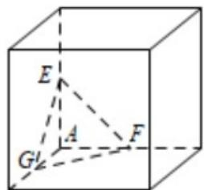
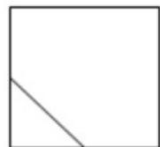

> [!faq]- 2021年全国高考甲卷数学（理）试题（解析版）A3解析
>
> > [!success]- **【答案】** D   
>
> > [!note]- **【分析】**
> > 根据题意及题目所给的正视图还原出几何体的直观图，结合直观图进行判断.
>
> > [!note]- **【解析】**
> > 由题意及正视图可得几何体的直观图，如图所示，
> >
> > 
> >
> > 所以其侧视图为
> >
> > 
> >
> > 故选：D
